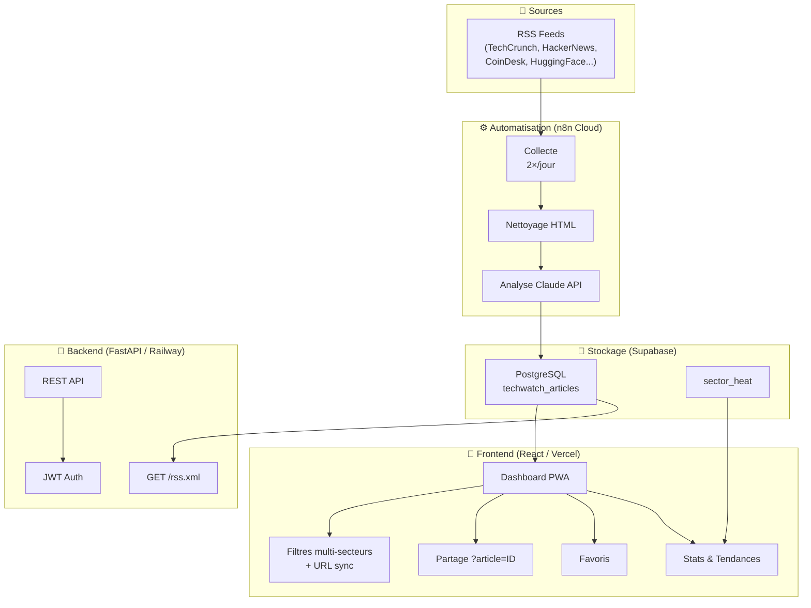

<div id="top">

<div align="center">

# TECH-WATCH-DASHBOARD

<em>Veille technologique automatisée par IA — analyses en temps réel</em>


<em>Built with the tools and technologies:</em>


</div>
<br>

---

## ✨ Highlights

- 📊 **~40 articles analysés par jour** depuis 5+ sources tech de référence
- ⚡ **Gain de 2h+/jour** grâce à la curation et l'analyse automatisées
- 🤖 **Analyses IA** via Claude 4 Sonnet pour extraire secteur, importance, sentiment et résumé
- 🔄 **Entièrement automatisé** avec n8n Cloud — 2 exécutions par jour (10h30 et 18h30)
- 🔗 **Partage par lien direct** — chaque article a son URL unique (`?article=ID`)
- 📱 **PWA-ready** — installable sur mobile et desktop

---

## Table of Contents

- [The Problem](#the-problem)
- [The Solution](#the-solution)
- [Architecture](#architecture)
- [Key Features](#key-features)
- [Getting Started](#getting-started)
- [Tech Stack](#tech-stack)

---

## 🎯 The Problem

Des dizaines d'articles tech sont publiés chaque jour. Les lire tous, trier, extraire les informations utiles et les organiser prend un temps considérable. Sans système automatisé, on finit soit à tout lire (épuisant), soit à rater l'essentiel.

## 💡 The Solution

**tech-watch-dashboard** automatise entièrement ce travail.

Deux fois par jour, n8n récupère les nouveaux articles depuis des flux RSS de sources tech sélectionnées. Chaque article est nettoyé puis envoyé à Claude via API avec un prompt structuré. Claude extrait les points clés, évalue l'importance (1-5⭐), détermine le sentiment et le secteur. Les résultats sont stockés dans Supabase (PostgreSQL) et exposés directement au frontend React.

---

## 🏗️ Architecture



---

## 🎯 Key Features

- 🧠 **Analyse IA** — Claude 4 Sonnet extrait secteur, importance, sentiment, actions boursières et résumé structuré
- 🔗 **Deep linking** — chaque article est accessible via `techwatch.fr/?article=UUID`, partageable et indexable
- 🗂️ **Filtres multi-secteurs** — sélection multiple avec sync URL (`?categories=IA,Cybersécurité`)
- 📊 **Stats & Tendances** — visualisation Recharts, heat map des secteurs actifs
- ⭐ **Favoris** — sauvegarde locale via localStorage
- 🔃 **Tri** — par date, score d'importance, ou A–Z
- 📡 **Flux RSS** — endpoint public `/rss.xml` consommable par Perplexity, lecteurs RSS, crawlers IA
- 🌍 **Bilingue** — bascule FR/EN sur les titres d'articles
- 📱 **PWA** — installable, offline indicator, prompt d'installation iOS
- 🟡 **Indicateur top articles** — bordure amber sur les articles importance 5

---

## 🚀 Getting Started

### Prerequisites

- Node.js 18+, npm ou yarn
- Python 3.11+, pip
- Instance n8n (cloud ou self-hosted)
- Clé API Anthropic (Claude)
- Projet Supabase avec la table `techwatch_articles`

### Installation

1. **Cloner le repo :**

```sh
git clone https://github.com/ThunderHawk31/tech-watch-dashboard
cd tech-watch-dashboard
```

2. **Frontend :**

```sh
cd frontend
yarn install
```

3. **Backend :**

```sh
cd backend
pip install -r requirements.txt
```

4. **Variables d'environnement :**

Frontend — les constantes Supabase sont dans `src/api.js` (clé anon publique).

Backend — créer un fichier `.env` dans `/backend` :

```env
DB_NAME=your_db_name
JWT_SECRET_KEY=your_secret
CORS_ORIGINS=https://techwatch.fr
SUPABASE_URL=https://your-project.supabase.co
SUPABASE_ANON_KEY=your_anon_key
```

### Usage

**Frontend :**
```sh
cd frontend
yarn start
```

**Backend :**
```sh
cd backend
uvicorn server:app --reload
```

**n8n :** importer les workflows depuis `/n8n workflow` dans votre instance et configurer les triggers horaires.

---

## 🛠️ Tech Stack

### ⚙️ Automatisation
| Technologie | Usage |
|------------|-------|
| n8n Cloud | Orchestration des workflows |
| Claude 4 Sonnet API | Analyse et structuration des articles |

### 💾 Stockage
| Technologie | Usage |
|------------|-------|
| Supabase (PostgreSQL) | Base de données principale |

### 🎨 Frontend
| Technologie | Usage |
|------------|-------|
| React 18 | Framework JavaScript |
| React Router v6 | Navigation et deep linking |
| Tailwind CSS | Styling |
| shadcn/ui (Radix UI) | Composants UI |
| Recharts | Graphiques et statistiques |
| Lucide Icons | Icônes |

### 🔧 Backend
| Technologie | Usage |
|------------|-------|
| FastAPI | API Python |
| httpx | Requêtes HTTP async (flux RSS) |
| JWT | Authentification |

### 🚀 Déploiement
| Technologie | Usage |
|------------|-------|
| Vercel | Frontend |
| Railway | Backend FastAPI |
| GitHub | Version control |

---

## 👤 Author

Projet développé par [Nolan](https://github.com/ThunderHawk31) dans le cadre du BTS SIO SISR — projet de veille technologique.

---

<div align="center">

Made with ❤️ for efficient tech intelligence gathering

[⬆ Return to top](#top)

</div>
