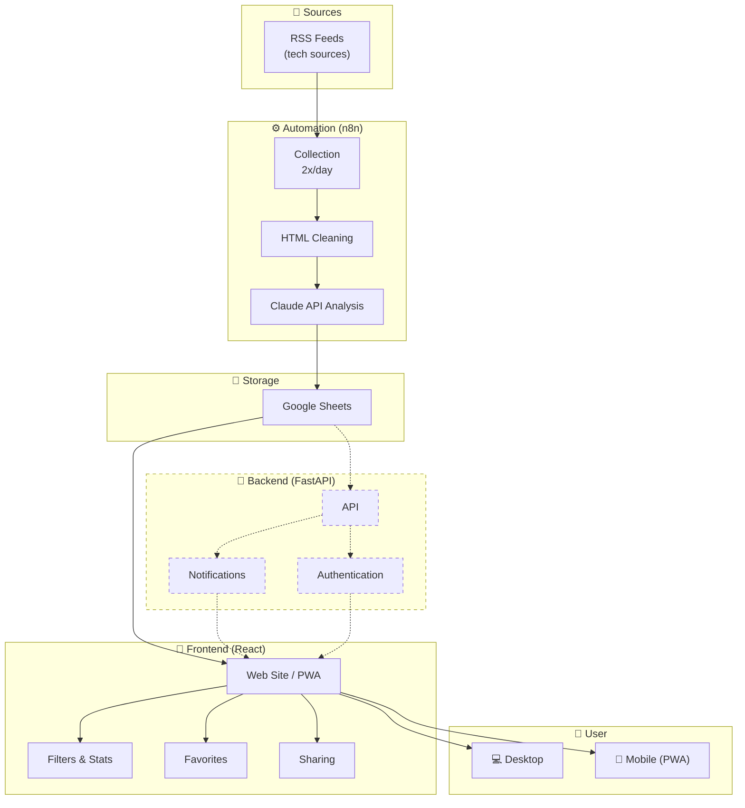

<div id="top">

<!-- HEADER STYLE: CLASSIC -->
<div align="center">

# TECH-WATCH-DASHBOARD

<em>Empowering smarter decisions through instant tech insights</em>

<!-- BADGES -->


<em>Built with the tools and technologies:</em>


</div>
<br>

---

## ✨ Highlights

- 📊 **~40 articles analyzed daily** from 5+ curated tech sources
- ⚡ **Saves 2.5+ hours/day** through automated content curation and analysis
- 🤖 **AI-powered insights** using Claude API (Sonnet) for intelligent article analysis
- 🔄 **Fully automated** with n8n workflows running 2x daily
- 📱 **PWA-enabled** for seamless mobile and desktop access

---

## Table of Contents

- [The Problem](#the-problem)
- [The Solution](#the-solution)
- [Architecture](#architecture)
- [Key Features](#key-features)
- [Getting Started](#getting-started)
    - [Prerequisites](#prerequisites)
    - [Installation](#installation)
    - [Usage](#usage)
    - [Testing](#testing)
- [Tech Stack](#tech-stack)

---

## 🎯 The Problem

Dozens of tech articles are published daily across different sources. Reading them all, sorting through them, extracting useful information, and storing it in an organized way takes considerable time. Without a system, you either end up reading everything (exhausting) or missing important information.

## 💡 The Solution

An automated system that does the work for you.

**tech-watch-dashboard** is an innovative developer tool designed to automate the monitoring and analysis of technology news. It aggregates RSS feeds, cleans and analyzes articles using AI, and stores insights in Google Sheets, enabling efficient tech intelligence gathering.

### ⚙️ How It Works

Twice daily, n8n retrieves new articles from RSS feeds of selected tech sources. Each article goes through a cleaner that removes HTML code to keep only text content, then is sent to Claude via API with a custom prompt. Claude extracts key points, evaluates the article's importance, and structures the analysis. Results are stored in Google Sheets.

---

## 🏗️ Architecture



> 📝 *Dashed elements represent features currently in development.*

---

## 🎯 Key Features

This project streamlines content curation and decision-making for tech professionals:

- 🧠 **AI-powered analysis:** Automates cleaning and insightful analysis of tech articles using Claude API
- 📊 **Data visualization:** Filter, visualize, and prioritize content through an intuitive web interface
- 📤 **Export & sharing:** Easily export data in CSV/JSON formats and share insights
- 📱 **Responsive design:** Access seamlessly on desktop and mobile devices (PWA-enabled)
- 🔒 **Secure user management:** Implements JWT authentication with scalable backend infrastructure
- ⭐ **Favorites system:** Save and organize important articles
- 🔔 **Smart notifications:** Get alerted when high-priority articles are published
- 🔍 **Advanced filtering:** Filter by theme and importance level

---

## 🚀 Getting Started

### Prerequisites

This project requires the following dependencies:

- **Programming Language:** JavaScript, Python
- **Package Manager:** npm, pip, yarn
- **n8n instance** (self-hosted or cloud)
- **Claude API key** (Anthropic)
- **Google Sheets API access**

### Installation

Build tech-watch-dashboard from the source and install dependencies:

1. **Clone the repository:**

    ```sh
    git clone https://github.com/ThunderHawk31/tech-watch-dashboard
    ```

2. **Navigate to the project directory:**

    ```sh
    cd tech-watch-dashboard
    ```

3. **Install frontend dependencies:**

**Using npm:**
```sh
npm install
```

**Using yarn:**
```sh
yarn install
```

4. **Install backend dependencies:**

**Using pip:**
```sh
pip install -r backend/requirements.txt
```

5. **Configure environment variables:**

Create a `.env` file with:
```env
CLAUDE_API_KEY=your_api_key
GOOGLE_SHEETS_ID=your_sheet_id
DATABASE_URL=your_mongodb_url
JWT_SECRET=your_secret
```

### Usage

Run the project:

**Frontend (using npm):**
```sh
npm start
```

**Frontend (using yarn):**
```sh
yarn start
```

**Backend (using pip):**
```sh
cd backend
uvicorn main:app --reload
```

**n8n workflows:**
Import the workflows from `/n8n-workflows` directory into your n8n instance and configure the schedule triggers.

### Testing

**Frontend tests (using npm):**
```sh
npm test
```

**Backend tests (using pytest):**
```sh
cd backend
pytest
```

---

## 🛠️ Tech Stack

### ⚙️ Automation
| Technology | Usage |
|-------------|-------|
| n8n | Workflow orchestration |
| Claude API (Sonnet) | Article analysis |
| Google Sheets | Data storage |

### 🎨 Frontend
| Technology | Usage |
|-------------|-------|
| React 19 | JavaScript framework |
| Tailwind CSS | Styling |
| Radix UI / shadcn/ui | UI components |
| Recharts | Charts and statistics |

### 🔧 Backend
| Technology | Usage |
|-------------|-------|
| FastAPI | Python API |
| MongoDB | Database |
| JWT | Authentication |

### 🚀 Deployment
| Technology | Usage |
|-------------|-------|
| Vercel | Frontend hosting |
| Railway | n8n hosting |
| GitHub | Version control |

---

## 📸 Screenshots

### Dashboard - Article Feed

*Main dashboard displaying analyzed articles with filters, importance ratings, and quick actions*

### Statistics & Analytics

*Visual analytics showing article distribution by sector and comprehensive insights*

### About Section

*Project overview explaining the automated workflow and AI-powered analysis*

---

## 👤 Author

Project developed by [Nolan](https://github.com/ThunderHawk31) as part of BTS SIO SISR program — Tech Watch project.

---

<div align="center">

Made with ❤️ for efficient tech intelligence gathering

[⬆ Return to top](#top)

</div>
