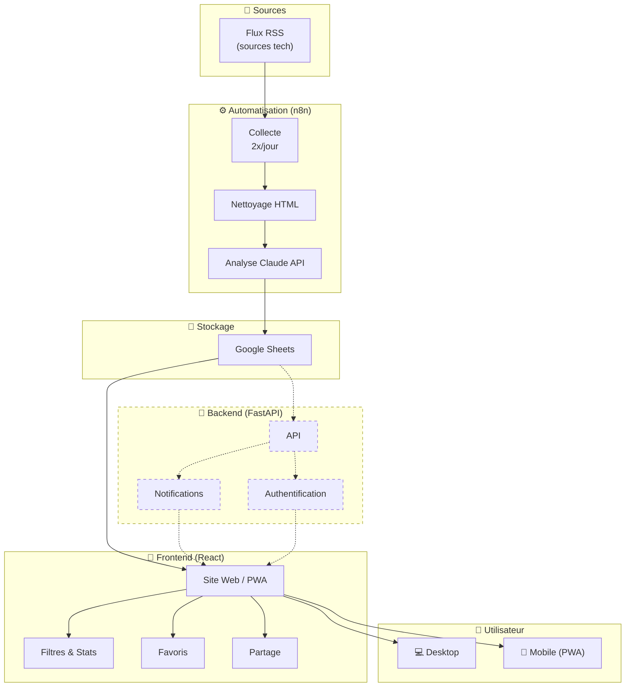

# 🤖 Système automatisé de veille technologique avec analyse IA

## ❓ Le problème

Des dizaines d'articles tech sortent chaque jour sur des sources différentes. Les lire, les trier, extraire les infos utiles et les stocker de manière organisée prend un temps considérable. Sans système, on finit soit par tout lire (épuisant), soit par rater des infos importantes.

## 💡 La solution

Un système automatisé qui fait le travail à ma place.

### ⚙️ Comment ça fonctionne

Deux fois par jour, n8n récupère les nouveaux articles depuis des flux RSS de sources tech que j'ai sélectionnées. Chaque article passe par un nettoyeur qui retire le code HTML pour ne garder que le contenu texte, puis est envoyé à Claude via API avec un prompt personnalisé. Claude extrait les points clés, évalue l'importance de l'article et structure l'analyse. Les résultats sont stockés dans Google Sheets.

### 🖥️ L'interface

Un site web (accessible aussi en PWA sur mobile) lit ces données et les affiche avec plusieurs fonctionnalités :

- 🔍 **Filtres** par thème et niveau d'importance
- 📊 **Statistiques visuelles** sur les thèmes abordés
- ⭐ **Favoris** pour sauvegarder les articles importants
- 🔗 **Partage** d'articles
- 🔔 **Notifications** quand un article prioritaire sort

---

## 🏗️ Architecture

> 📝 *Les éléments en pointillés représentent les fonctionnalités en cours de développement.*

---

## 🛠️ Technologies utilisées

### ⚙️ Automatisation
| Technologie | Usage |
|-------------|-------|
| n8n | Orchestration des workflows |
| Claude API (Sonnet) | Analyse des articles |
| Google Sheets | Stockage des données |

### 🎨 Frontend
| Technologie | Usage |
|-------------|-------|
| React 19 | Framework JavaScript |
| Tailwind CSS | Styling |
| Radix UI / shadcn/ui | Composants UI |
| Recharts | Graphiques et statistiques |

### 🔧 Backend
| Technologie | Usage |
|-------------|-------|
| FastAPI | API Python |
| MongoDB | Base de données |
| JWT | Authentification |

### 🚀 Déploiement
| Technologie | Usage |
|-------------|-------|
| Vercel | Hébergement frontend |
| Railway | Hébergement n8n |
| GitHub | Gestion de version |

---

## 📸 Aperçu

*Screenshots à venir*

---

## 👤 Auteur

Projet réalisé par Nolan dans le cadre du BTS SIO SISR — Veille technologique.
