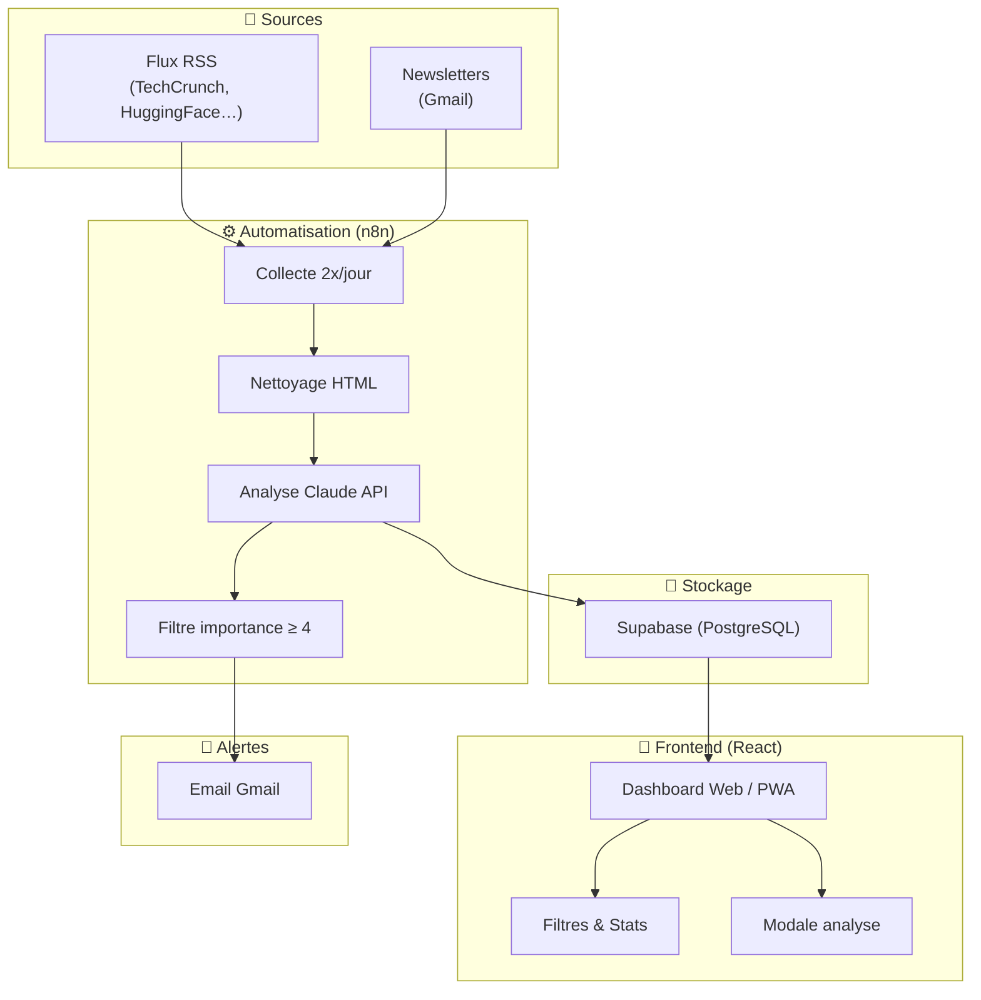

<div id="top">
<div align="center">

# TECH-WATCH-DASHBOARD

<em>Dashboard de veille technologique et financière — automatisé avec n8n + Claude AI</em>


</div>

---

## ✨ Highlights

- 📊 **~40 articles analysés par jour** depuis 5+ sources RSS tech/finance/crypto
- ⚡ **Gain de temps** grâce à la curation et l'analyse automatisées
- 🤖 **Analyse IA** via Claude API (secteur, importance 1-10, sentiment, tickers)
- 🔄 **Entièrement automatisé** avec n8n, 2x par jour
- 📱 **PWA** accessible sur mobile et desktop
- 🔔 **Alertes Gmail** pour les articles importance ≥ 4

---

## Table des matières

- [Le problème](#-le-problème)
- [La solution](#-la-solution)
- [Architecture](#️-architecture)
- [Fonctionnalités](#-fonctionnalités)
- [Stack](#️-stack)
- [Setup (~30 min)](#-setup-30-min)
- [MCP — Contrôler n8n depuis Claude](#-bonus--contrôler-n8n-depuis-claude-mcp)
- [Structure du repo](#-structure-du-repo)
- [Personnalisation](#-personnalisation)
- [Problèmes fréquents](#-problèmes-fréquents)
- [Auteur](#-auteur)

---

## 🎯 Le problème

Des dizaines d'articles tech/finance/crypto sont publiés chaque jour. Les lire tous, trier, extraire l'essentiel et garder une trace prend un temps considérable. Sans système, on rate l'important ou on passe des heures à surveiller.

## 💡 La solution

**tech-watch-dashboard** agrège automatiquement les flux RSS, analyse chaque article avec Claude AI, et affiche les résultats sur un dashboard web avec filtres, statistiques et alertes.

---

## 🏗️ Architecture


```mermaid
flowchart TB
    subgraph Sources["📰 Sources"]
        RSS["Flux RSS\n(TechCrunch, HuggingFace…)"]
        NL["Newsletters\n(Gmail)"]
    end

    subgraph Automation["⚙️ Automatisation (n8n)"]
        Collect["Collecte 2x/jour"]
        Clean["Nettoyage HTML"]
        Analyze["Analyse Claude API"]
        Filter["Filtre importance ≥ 4"]
    end

    subgraph Storage["💾 Stockage"]
        Supa["Supabase (PostgreSQL)"]
    end

    subgraph Frontend["🎨 Frontend (React)"]
        Site["Dashboard Web / PWA"]
        Filters["Filtres & Stats"]
        Modal["Modale analyse"]
    end

    subgraph Alerts["🔔 Alertes"]
        Gmail["Email Gmail"]
    end

    RSS --> Collect
    NL --> Collect
    Collect --> Clean
    Clean --> Analyze
    Analyze --> Filter
    Filter --> Gmail
    Analyze --> Supa
    Supa --> Site
    Site --> Filters
    Site --> Modal
```

---

## 🎯 Fonctionnalités

- 🧠 **Analyse IA** : nettoyage et analyse des articles via Claude API (secteur, importance, sentiment, tickers)
- 📊 **Dashboard** : filtres par secteur, tri par date/importance, statistiques visuelles
- 🔍 **Modale** : affichage de l'analyse complète avec résumé exécutif et points clés
- 🔔 **Alertes email** : Gmail pour les articles importance ≥ 4
- 📱 **PWA** : installable sur mobile
- 🏷️ **Badges dynamiques** : sources et secteurs affichés sur chaque article
- 📋 **Watchlist tickers** : suivi de valeurs financières
- 🌡️ **Heatmap secteurs** : visualisation des tendances par secteur

---

## 🛠️ Stack

| Composant | Technologie | Coût |
|-----------|-------------|------|
| Automatisation | n8n | Gratuit 15j → voir étape 3 |
| Analyse IA | Claude API Sonnet | ~$5/mois usage perso |
| Base de données | Supabase (PostgreSQL) | Gratuit |
| Frontend | React sur Vercel | Gratuit |

---

## 🚀 Setup (~30 min)

### Étape 1 — Créer la base de données Supabase

1. Aller sur **[supabase.com](https://supabase.com)** → "Start your project" → créer un compte (gratuit)
2. Cliquer **"New project"** → choisir un nom → noter le mot de passe → créer
3. Attendre ~2 minutes que le projet soit prêt
4. Dans le menu gauche → **"SQL Editor"** → cliquer **"New query"**
5. Copier-coller le SQL ci-dessous → cliquer **"Run"** (▶️) :

```sql
-- Table principale des articles
create table techwatch_articles (
  article_id uuid default gen_random_uuid() primary key,
  title text,
  title_en text,
  published_at timestamptz,
  url text unique,
  analysis text,
  importance int,
  sentiment text,
  tickers text,
  sector text,
  tokens int,
  created_at timestamptz default now()
);

-- Autoriser la lecture publique (nécessaire pour le frontend)
alter table techwatch_articles enable row level security;
create policy "Public read" on techwatch_articles for select using (true);

-- Table des sources (pour les badges sur les articles)
create table flux_sources (
  id uuid default gen_random_uuid() primary key,
  name text,
  domain text,
  type text,
  active boolean default true
);
alter table flux_sources enable row level security;
create policy "Public read" on flux_sources for select using (true);
```

6. Aller dans **Project Settings** → **"API"** → cliquer sur **"Legacy anon, service_role API keys"** et noter :
   - **Project URL** : `https://xxxxxxxxxxxx.supabase.co`
   - **anon / public key** : commence par `eyJ...` (pour le frontend)
   - **service_role key** : cliquer "Reveal" (pour n8n uniquement — ne jamais mettre dans le code frontend)

---

### Étape 2 — Déployer le site web sur Vercel

1. Aller sur **[vercel.com](https://vercel.com)** → "Log in with GitHub"
2. Cliquer **"Add New… > Project"** → coller l'URL du repo : `https://github.com/ThunderHawk31/tech-watch-dashboard`
3. Dans **"Root Directory"**, écrire : `frontend`
4. Ouvrir **"Environment Variables"** et ajouter :

| Nom | Valeur |
|-----|--------|
| `REACT_APP_SUPABASE_URL` | Votre Project URL (ex : `https://xxxx.supabase.co`) |
| `REACT_APP_SUPABASE_ANON_KEY` | Votre anon key |
| `REACT_APP_SUPABASE_BASE_URL` | Même valeur que `REACT_APP_SUPABASE_URL` |

5. Cliquer **"Deploy"** → dans ~2 minutes votre site est en ligne ✅

> À ce stade le site s'affiche mais sans articles — c'est n8n qui va les injecter.

---

### Étape 3 — Installer et configurer n8n

n8n doit tourner en permanence sur un serveur.

**Option A — n8n Cloud (recommandé, 15 jours d'essai gratuit)**
1. Aller sur **[n8n.io](https://n8n.io)** → "Get started for free" → créer un compte
2. Un instance n8n est créée automatiquement — noter votre URL (ex : `https://moninstance.app.n8n.cloud`)
3. Après les 15 jours d'essai, l'abonnement est payant (~$20/mois)

**Option B — Railway (~12€/mois)**
1. Aller sur **[railway.app](https://railway.app)** → créer un compte (via GitHub)
2. Cliquer **"New Project"** → **"Deploy from template"** → chercher **"n8n"** → Deploy
3. Attendre le déploiement (~3 min) → copier le domaine public → ouvrir dans le navigateur → créer un compte n8n
4. ⚠️ Railway est plus complexe à mettre en place et son coût est d'environ **12€/mois** — l'option A (n8n Cloud) est recommandée pour débuter

**Option C — NAS ou serveur personnel** (si vous en avez un, contactez l'auteur)

---

### Étape 4 — Importer le workflow n8n

Les fichiers workflow sont dans le dossier [`n8n-workflow/`](n8n-workflow/) de ce repo.

> ⚠️ Les fichiers contiennent des placeholders à remplacer par vos propres credentials avant utilisation.

1. Dans n8n → menu gauche **"Workflows"** → **"Add workflow"** → icône **"..."** en haut → **"Import from file"**
2. Sélectionner le fichier **`Analyseur_Article_Finance_Auto_RSS.json`** — c'est le **workflow principal**, celui qui fait tout tourner
3. Importer également le fichier **`Techwatch_Error_Workflow.json`** — ce workflow gère les erreurs et envoie un **email automatique** si l'un de vos workflows rencontre une erreur

   > 💡 **Activer les notifications d'erreur** : pour chaque workflow importé, juste à côté du bouton **"Active"** (Published), cliquer sur le **bouton à gauche** → **"Set up error notifications"** → choisir **Techwatch Error Workflow**. À faire pour **tous les workflows**.

4. Configurer les **Credentials** (menu gauche → "Credentials" → "Add credential") :

   **Claude API** (obligatoire)
   - Aller sur **[console.anthropic.com](https://console.anthropic.com)** → se connecter ou créer un compte → "API Keys" → créer une clé (`sk-ant-...`)
   - Dans n8n : type **"Header Auth"** → Header Name : `x-api-key` → Value : votre clé Claude
   - Nommer exactement : `Clé API Claude`

   **Supabase Service Role** (obligatoire — écriture en base)
   - Dans n8n : type **"Bearer Token Auth"** → Token : votre **service_role key** Supabase
   - Nommer : `Clé Service Role Supabase`
   - **Important** : dans chaque node avec un header `apikey` hardcodé (Insert Supabase, Log Article Skippé, Charger entités VIP, Charger Watchlist), remplacer `YOUR_SUPABASE_SERVICE_ROLE_KEY` par votre clé

   **Supabase Anon** (obligatoire — lecture)
   - Dans n8n : type **"Header Auth"** → Header Name : `apikey` → Value : votre **anon key** Supabase
   - Nommer : `Clé Anon Supabase`

   **Gmail** (optionnel — alertes email)
   - Dans n8n : type "Google OAuth2" → suivre les instructions d'autorisation

5. **Mettre à jour les URLs Supabase** : dans chaque node HTTP Request pointant vers Supabase, remplacer `YOUR_PROJECT_ID` par votre vrai project ID
6. Cliquer **"Save"** puis activer le workflow (toggle en haut à droite)

---

### Étape 5 — Vérifier que tout fonctionne

1. Dans n8n → ouvrir le workflow → cliquer **"Execute Workflow"** (test manuel)
2. Vérifier que les nodes s'exécutent sans erreur (icônes vertes)
3. Retourner sur votre site Vercel → actualiser → les articles doivent apparaître ✅

---

## 🤖 Bonus — Contrôler n8n depuis Claude (MCP)

Vous pouvez connecter votre instance n8n à Claude pour gérer les workflows en langage naturel, sans ouvrir l'interface n8n.

### Récupérer les détails de connexion MCP dans n8n

1. Dans n8n → menu gauche **"Settings"** → **"Instance-level MCP"**
2. Cliquer **"Connection details"**
3. Choisir **"OAuth"** → copier l'URL et les informations affichées

### Option A — Sur claude.ai (interface web)

1. Aller sur **[claude.ai](https://claude.ai)** → cliquer sur votre avatar en haut à droite → **"Personnaliser"**
2. Dans le menu gauche → **"Connecteurs"**
3. Cliquer le bouton **"+"** → **"Parcourir les connecteurs"**
4. Chercher **n8n** dans la liste → cliquer dessus
5. Renseigner l'URL et les informations OAuth copiées depuis n8n
6. Cliquer **"Connecter"** ✅

Claude peut ensuite exécuter, lister et modifier vos workflows directement depuis la conversation.

### Option B — Dans Claude Code (CLI)

1. Ouvrir Claude Code → taper `/config`
2. Aller dans **"MCP Servers"** → chercher **"n8n"** → activer
3. Renseigner les mêmes informations de connexion qu'en option A

---

## 📁 Structure du repo

```
tech-watch-dashboard/
├── frontend/          # App React → déployer sur Vercel
│   ├── src/
│   └── .env.example   # Variables à configurer
├── n8n-workflow/      # Workflows n8n à importer (credentials à remplacer)
└── README.md
```

---

## 🔧 Personnalisation

- **Ajouter/retirer des sources RSS** : modifier le node "Source RSS" dans n8n
- **Changer le seuil d'alerte** : modifier la condition `importance ≥ 4` dans le node "If"
- **Ajouter une newsletter** : insérer une ligne dans la table `flux_sources` (type = `newsletter`) — aucun code à modifier

### Adapter les newsletters

Le workflow inclut des branches prédéfinies pour traiter des newsletters spécifiques (ZoneBourse, Aktionnaire, MoneyRadar). Ces branches sont celles **reliées au nœud Gmail (newsletters)**, juste en dessous de la section **"Zone IA & Nettoyage"**. Chaque newsletter a sa propre branche : Cleaner Email → Claude API → Parser Newsletter.

Pour adapter à vos propres newsletters :
1. Dans n8n → ouvrir le workflow → repérer les branches connectées au **nœud Gmail newsletters** (sous la section "Zone IA & Nettoyage")
2. Dupliquer une branche newsletter existante
3. Modifier le **Gmail Trigger** pour cibler votre newsletter (filtre par expéditeur ou objet)
4. Adapter le prompt dans le node **Claude API** à votre newsletter
5. Mettre à jour le **Parser Newsletter** si le format de sortie change
6. Ajouter la newsletter dans la table `flux_sources` Supabase (pour le badge affiché sur le dashboard)

---

## ❓ Problèmes fréquents

| Symptôme | Cause probable | Solution |
|----------|---------------|----------|
| Site blanc / erreur CORS | Variables d'env manquantes | Vérifier les 3 variables dans Vercel → Redeploy |
| Pas d'articles après exécution | Supabase mal configuré | Vérifier que la table `techwatch_articles` existe |
| Erreur node "Insert Supabase" | Mauvaise clé (anon au lieu de service_role) | Utiliser la service_role key en Bearer Token Auth |
| Claude API erreur 401 | Clé API invalide ou pas de crédit | Vérifier sur console.anthropic.com |
| Importance 3 reçu en alerte | Comparaison string vs number dans n8n | Vérifier le type du champ dans le node "If" |

---

## 👤 Auteur

Développé par [Nolan](https://github.com/ThunderHawk31) — BTS SIO SISR

Pour de l'aide sur le setup : contacter l'auteur via GitHub.

[⬆ Retour en haut](#top)
